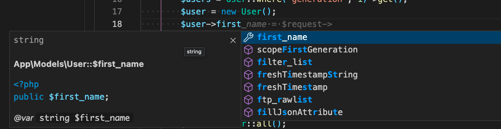

# 39週目ミニドリル 1問目

## 事前準備

以下手順で環境の立ち上げをお願いします。(※ 10分 ~ 15分 かかります)

`docker compose build --no-cache`

`docker compose up -d`

`docker compose exec ph3-posseapp-app bash`

- appコンテナ内

(#以降のコマンドを入力してください)

`/var/www/html# composer install`

`/var/www/html# php artisan migrate:refresh --seed`

- ブラウザ
  - マイグレーション、シーディングを完了後に、http://localhost に遷移してユーザーが表示されていれば問題開始できます

## 問題

phpDocumentor (PHPDoc) の利用について慣れてもらいます

形式通りにコメントを書くことでエディターで補完やタイプミスを事前に防ぐことに繋がります (人間どんだけ気をつけていてもミスする時はあります)

どういう属性があるのか知っておくことでミスが発生しにくくなるので問題を解くことで覚えましょう

### 修正箇所

src/app/Models/User.php の 14行目の上に添付する PHPDoc を追加

```php
/**
 * @property string $first_name 名前
 */
```

HomeController 18行目のコメントを解除してfirst_nameが補完されるかどうか (firsぐらいまで打たないと候補でないかもです)



### 終了条件

src/app/Models/User.php にusersテーブルのカラムを一つ `@property` で追加して補完されることを確認してください
