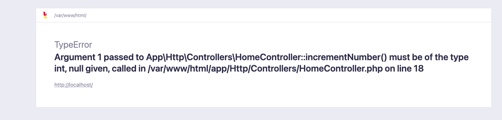

# 39週目ミニドリル 3問目

## 事前準備

以下手順で環境の立ち上げをお願いします。(※ 10分 ~ 15分 かかります)

`docker compose build --no-cache`

`docker compose up -d`

`docker compose exec ph3-posseapp-app bash`

- appコンテナ内

(#以降のコマンドを入力してください)

`/var/www/html# composer install`

`/var/www/html# php artisan migrate:refresh --seed`

- ブラウザ
  - マイグレーション、シーディングを完了後に、http://localhost に遷移してユーザーが表示されていれば問題開始できます

## 問題

今回は型注釈について学んでいきます

PHPではPHPDocとは別に引数や関数の返り値に型を指定することができます
[公式ドキュメント](https://www.php.net/manual/ja/language.types.declarations.php)

+ 型を指定することでよりバグを生じさせにくいコードになるのでなるべく利用してほしい
+ OSS等のコードによく記載されているので迷う箇所を減らして読める

上記２点から今回修正をしていだきます

### 修正箇所

`docker compose exec ph3-posseapp-app bash`

HomeController:29 ~ 36 行目を参考にHomeControllerにincrementNumberという関数を作成してください

+ 引数に数値のみを受け付ける型指定
+ 返り値に数値のみを受け付ける型指定

以下ヒント
```php
public function incrementNumber(/** 引数 */) /** 返り値 */
{
  return /** ++引数 */
}
```

### 終了条件

http://localhost に以下条件を満たして遷移

- HomeControllerの18行目のコメントアウトを解除してエラーになること
- HomeControllerの19行目のコメントアウトを解除して2が出力されること (18行目は削除してください)


