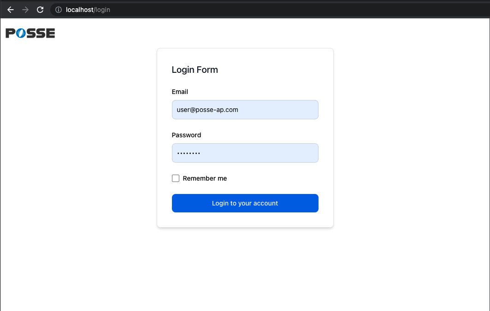

# 40週目ミニドリル 1問目

## 事前準備

以下手順で環境の立ち上げをお願いします。(※ 10分 ~ 15分 かかります)

`docker compose build --no-cache`

`docker compose up -d`

`docker compose exec ph3-posseapp-app bash`

- appコンテナ内

(#以降のコマンドを入力してください)

`/var/www/html# composer install`

`/var/www/html# php artisan migrate:refresh --seed`

- ブラウザ
  - マイグレーション、シーディングを完了後に、http://localhost に遷移してwelcomeページが表示されていれば問題に移ることができます

## 問題

week40はログインページについて問題が発生しているので解消してください

- `auth/login.blade.php`はあります
- ログインページが表示されません
- ブラウザではリダイレクトされすぎてエラー表示になっています
- Auth/LoginController.phpにはloginアクションが存在しないように見えますが、 `use AuthenticatesUsers;` が怪しいです

### 修正箇所

web.php 17行目 のアクションの指定を正しい形に直してください

※ Auth/LoginController.phpに新しくloginアクションを追加するのはなしです

### 終了条件

- web.phpを修正後に`php artisan optimize` or `php artisan route:cache` を実行してください

- [localhost/login](http://localhost/login) に遷移して添付するフォームイメージと同じフォームが表示されること

