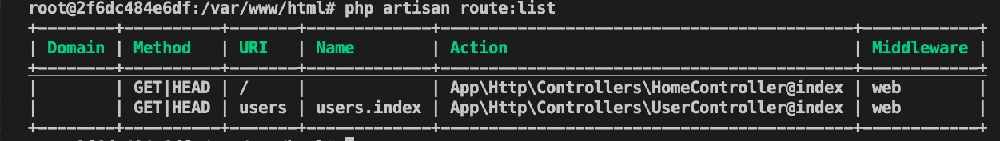

# 41週目ミニドリル 1問目

## 事前準備

以下手順で環境の立ち上げをお願いします。(※ 10分 ~ 15分 かかります)

`docker-compose build --no-cache`

`docker-compose up -d`

`docker-compose exec ph3-posseapp-app bash`

- appコンテナ内

(#以降のコマンドを入力してください)

`/var/www/html# composer install`

`/var/www/html# php artisan migrate:refresh --seed`

- ブラウザ
  - マイグレーション、シーディングを完了後に、http://localhost に遷移してwelcomeページが表示されていれば問題に移ることができます

## 問題

week41では `Route::resource()` で利用できるルーティングを制限したいのでその対応をお願いします

- `php artisan make:controller UserController --resource` コマンドを実行してアクション一覧を自動生成しました
- web.php に `Route::resource('users', 'UserController');` を記述しました
- `php artisan route:cache` 実行後に `php artisan route:list` でルーティング一覧を確認して反映されていることを確認しました
- 現在は一覧表示(index) のみに機能を絞りたいのでweb.phpで制限をかけたい

### 修正箇所

web.php 17行目 の`Route::resource('users', 'UserController');` をindexのみ利用できるように修正してください

※ 利用できるメソッドが2パターンあるのでどちらでも大丈夫です

### 終了条件

- web.phpを修正後に`php artisan optimize` or `php artisan route:cache` を実行してください

- `php artisan route:list` を実行して表示される一覧にusers.indexのみ表示されていること

