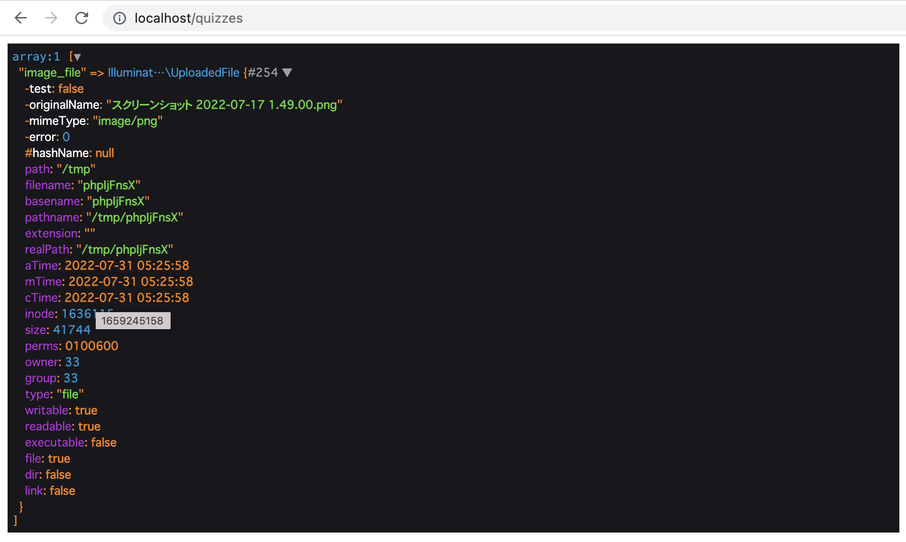

# 43週目ミニドリル 1問目

## 事前準備

以下手順で環境の立ち上げをお願いします。(※ 10分 ~ 15分 かかります)

`docker compose build --no-cache`

`docker compose up -d`

`docker compose exec ph3-posseapp-app bash`

- appコンテナ内

(#以降のコマンドを入力してください)

`/var/www/html# composer install`

`/var/www/html# php artisan migrate:refresh --seed`

- ブラウザ
  - マイグレーション、シーディングを完了後に、http://localhost に遷移してwelcomeページが表示されていれば問題に移ることができます

## 問題

week43では `/quizzes/create` で画像の保存をしようとしています

バリデーションの結果をQuizControllerのstoreメソッドでチェックしています

- pngの画像をアップロードしてもエラーになってしまいます*こいつを解消したい

### 修正箇所

quiz/create.blade.php 14行目 のformエレメントに属性が不足しているので追加したら解消しそうです

### 終了条件

- 画像をアップロードしてサンプルと同じ状態が表示されること