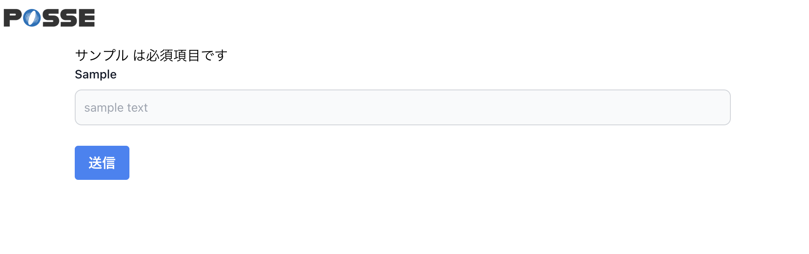

# 44週目ミニドリル 1問目

## 事前準備

以下手順で環境の立ち上げをお願いします。(※ 10分 ~ 15分 かかります)

`docker-compose build --no-cache`

`docker-compose up -d`

`docker-compose exec ph3-posseapp-app bash`

- appコンテナ内

(#以降のコマンドを入力してください)

`/var/www/html# composer install`

`/var/www/html# php artisan migrate:refresh --seed`

- ブラウザ
  - マイグレーション、シーディングを完了後に、http://localhost に遷移してwelcomeページが表示されていれば問題に移ることができます

## 問題

week44ではバリデーションメッセージを日本語化したいです

- `localhost/quizzes/create` フォームでsampleのインプットを必須項目としています

- フォームに何もいれずに送信を押すと「The サンプル field is required.」とメッセージが表示されるのでバリデーションエラーのメッセージを日本語にしたい

### 修正箇所

QuizCreateRequest.php に messagesメソッドを作成するとうまくいきそうです

- 公式ドキュメントのエラーメッセージのカスタマイズを見るとわかると思います

https://readouble.com/laravel/6.x/ja/validation.html

### 終了条件

- インプットに何も指定せず送信すると画像と同じ状態になること