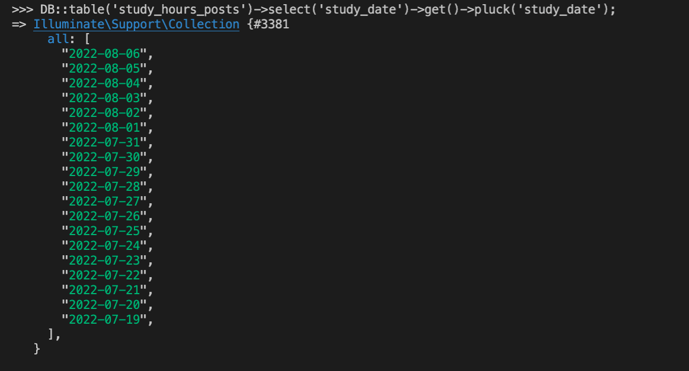

# 44週目ミニドリル 1問目

## 事前準備

以下手順で環境の立ち上げをお願いします。(※ 10分 ~ 15分 かかります)

`docker compose build --no-cache`

`docker compose up -d`

`docker compose exec ph3-posseapp-app bash`

- appコンテナ内

(#以降のコマンドを入力してください)

`/var/www/html# composer install`

`/var/www/html# php artisan migrate:refresh --seed`

- ブラウザ
  - マイグレーション、シーディングを完了後に、http://localhost に遷移してwelcomeページが表示されていれば問題に移ることができます

## 問題

week45ではSeederで日付や日時の指定をCarbonを利用するようにしたいです

- StudyHoursPostsSeeder.php でコメントアウトしていますが、study_dateに日付を直指定しています

- ただこのままでは毎回 2022年の8月8日が勉強の記録となるのでカリキュラムを進めるタイミングで毎回書き換えなくてはいけないのでここを修正したいです

### 修正箇所

StudyHoursPostsSeeder.php に Carbon のsubDaysの引数にforの$iを利用することでSeeder実行時の20日前まで生成されそうです

- Laravelの日付操作は基本的にCarbonを利用します。(php標準のdateやdatetimeはなるべくつかわないでください)
- subDaysは以下の記事を参考にしてみてください

https://coinbaby8.com/carbon-laravel.html

### 終了条件

- StudyHoursPostsSeederのコメントアウトを解除
- `php artisan migrate:refresh --seed`
- `php artisan tinker` で対話モード
- `DB::table('study_hours_posts')->select('study_date')->get()->pluck('study_date');` を実行
- サンプルと同じような20日前までの日付が羅列されること