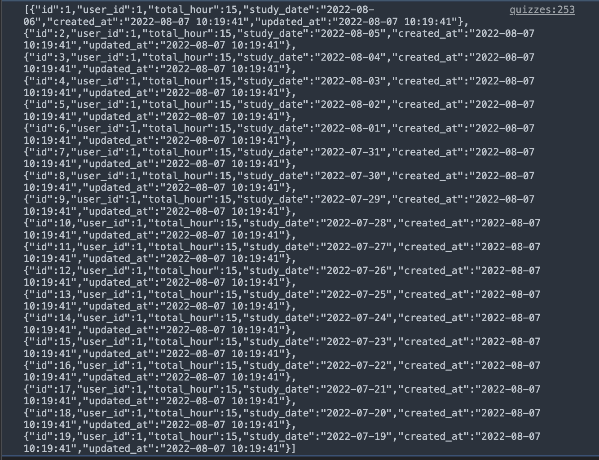

# 44週目ミニドリル 1問目

## 事前準備

以下手順で環境の立ち上げをお願いします。(※ 10分 ~ 15分 かかります)

`docker-compose build --no-cache`

`docker-compose up -d`

`docker-compose exec ph3-posseapp-app bash`

- appコンテナ内

(#以降のコマンドを入力してください)

`/var/www/html# composer install`

`/var/www/html# php artisan migrate:refresh --seed`

- ブラウザ
  - マイグレーション、シーディングを完了後に、http://localhost に遷移してwelcomeページが表示されていれば問題に移ることができます

## 問題

week46ではPHPの変数をJavaScript側で利用する方法について解いてもらいます

- http://localhost/quizzes にアクセスすると学習時間がconsole.logで文字化けした状態で出力されます

- ただこのままでは`""`が`&quot;id&quot;` と表現されて本来期待する形と異なるのでので、laravelのヘルパメソッドを利用してjsonに変換してください

### 修正箇所

[Laravelのガイドライン_JSについて](https://xqsit.github.io/laravel-coding-guidelines/docs/avoid-js-css-blade-template/)

- 上記を参考にエレメント側にJSONの情報を出してそのエレメントから値を取得するように変更してください
- '\@json(xxx)'のようにシングルクウォートで囲わないと変な感じになるので注意してください

### 終了条件

- http://localhost/quizzes にアクセスすると学習時間が画像と同じように開発ツールの方で出力されていることされること