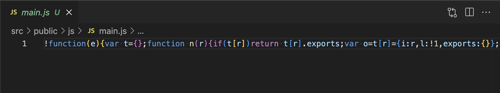

# 48週目ミニドリル 1問目

## 事前準備

以下手順で環境の立ち上げをお願いします。(※ 10分 ~ 15分 かかります)

`docker-compose build --no-cache`

`docker-compose up -d`

`docker-compose exec ph3-posseapp-app bash`

- appコンテナ内

(#以降のコマンドを入力してください)

`/var/www/html# composer install`

`/var/www/html# php artisan migrate:refresh --seed`

`exit`

- node系

`docker-compose exec node bash`

- node コンテナ内

- `npm install`

- ブラウザ
  - マイグレーション、シーディングを完了後に、http://localhost に遷移してwelcomeページが表示されていれば問題に移ることができます

## 問題

week48ではLaravel Mixでできることをすこしだけ学びます

- JavaScriptやCSSファイルの圧縮や、xxx.jsやyyy.jsなどの複数のjsファイルをいいかんじに1つのファイルにまとめるくれるパッケージとして[webpack](https://webpack.js.org/)があります。ただwebpackは利用するのに結構設定ファイルを自前で用意する必要があります。そこで設定ファイルをあまり書かなくても圧縮やまとめると直感的に書くことでできるようにするのがLaravel Mixです

- ちょっと前提がながくなってしまいましたが、laravel Mixを使ってJavaScriptファイルの圧縮を今回試してほしいです

- resources/js/main.js を 外部にも公開できるようにpublicにビルドされるようにwebpack.mex.js に設定を記述しました

### 修正箇所

- package.jsonを解読してどのコマンドを実行したら良いか見てみてください。(ビルドはだいたい本番環境向けです)

### 終了条件

- public/js/main.jsが生成されていること
- 生成されている main.jsが1行に圧縮されていること